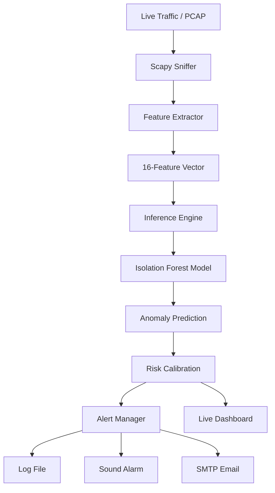

# 🛡️ Self-Learning AI Intrusion Detection System (IDS)

[](https://www.python.org/)
[](https://scikit-learn.org/)
[](https://flask.palletsprojects.com/)
[](https://opensource.org/licenses/MIT)

A high-performance, **Self-Learning Intrusion Detection System** built from the ground up using Network Security principles and Advanced Machine Learning. This system doesn't just block known threats—it **learns** your network's normal behavior and detects novel anomalies in real-time.

---

## 🎬 Project Showcase: Live Dashboard
Experience the system's real-time analysis through our high-fidelity dashboard:


**Key Highlights (~45 seconds):**
1. **Live Traffic Monitoring**: Captured directly from the system's `WiFi` adapter.
2. **Deep-Packet AI Analysis**: Real-time scoring using our custom **Isolation Forest** implementation.
3. **Interactive Threat Triage**: Selecting packets to reveal underlying feature distributions.
4. **Visual Risk Index**: Dynamic `Chart.js` integration showing network health trends.

---

## 🚀 Core Features

- **🧠 Self-Learning AI Engine**: Uses unsupervised **Isolation Forest** to detect threats without predefined signatures.
- **⚡ Real-Time Pipeline**: Zero-latency processing of 16 network features per packet.
- **🛡️ Multi-Channel Alerting**: Instant notifications via standard Logs, Desktop Sound, and SMTP Email.
- **📊 3D Forensics**: Interactive dashboard with protocol filtering (TCP/UDP/ICMP) and source-based triage.
- **⚖️ Dynamic Calibration**: Multi-point quantile mapping ensures consistent 1-100% Risk scaling.
- **✅ Rock-Solid Validation**: Includes a comprehensive **25-test suite** covering every module from capture to inference.

---

## 🛠️ Technology Stack

| Layer | Technologies |
|-------|--------------|
| **Core Engine** | Python 3.10+, Scapy (Packet Sniffing/Parsing) |
| **Machine Learning** | Scikit-learn (Isolation Forest), Pandas, NumPy |
| **Web Infrastructure** | Flask, Werkzeug, Jinja2 |
| **Frontend/UI** | Vanilla CSS (Glassmorphism), Chart.js, Lucide Icons |
| **Testing/QA** | Pytest, Shutil, OS-level handle management |

---

## 🧩 System Architecture



---

## 📁 Project Structure

```text
self-learning-ids/
├─ app.py                # Main System Entry Point
├─ saved_model.pkl       # Serialized AI Brain
├─ ids/                  # The Core Engine
│  ├─ capture.py         # Packet Sniffing & Replay
│  ├─ features.py        # 16-Feature Extraction Logic
│  ├─ model.py           # Isolation Forest Interface
│  ├─ realtime.py        # High-Speed Inference Loop
│  └─ dashboard.py       # Metrics Aggregator & Metrics
├─ web/                  # API and Routing Layer
├─ templates/            # Professional Dashboard UI
├─ tests/                # Full 25-test Validation Suite
└─ data/                 # Sample Datasets & PCAPs
```

---

## ⚡ Quick Start

### 1. Prerequisites
- **Python 3.8+**
- **Npcap/libpcap** (for live sniffing)

### 2. Setup Environment
```powershell
python -m venv venv
.\venv\Scripts\Activate.ps1
pip install -r requirements.txt
```

### 3. Run Live Monitoring
```powershell
python app.py --serve --mode live --iface WiFi
```
*Navigate to http://127.0.0.1:5001 to view the dashboard.*

---

## ✅ Validation Summary
The project includes a rigorous test suite that can be executed via:
```powershell
python -m pytest
```
**Current Status:** `25 Passed | 0 Failed`

---

## 📝 License
Distributed under the MIT License. See `LICENSE` for more information.

Developed with ❤️ by [Vishh70](https://github.com/Vishh70).
